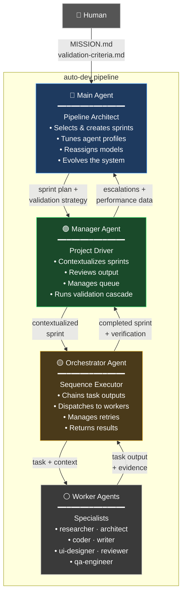
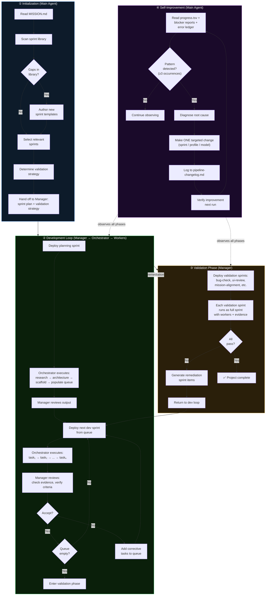
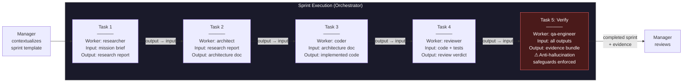
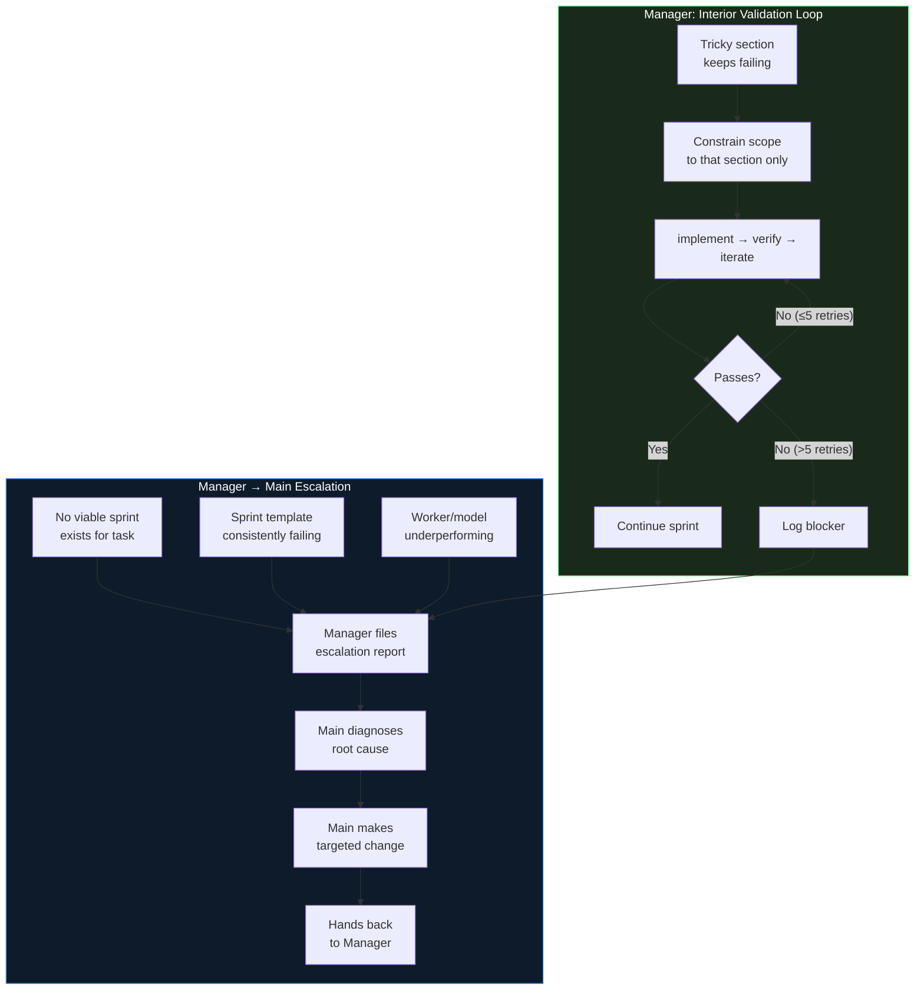
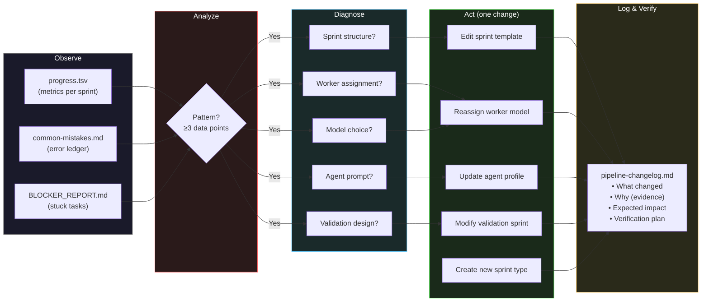
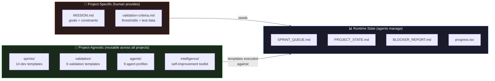
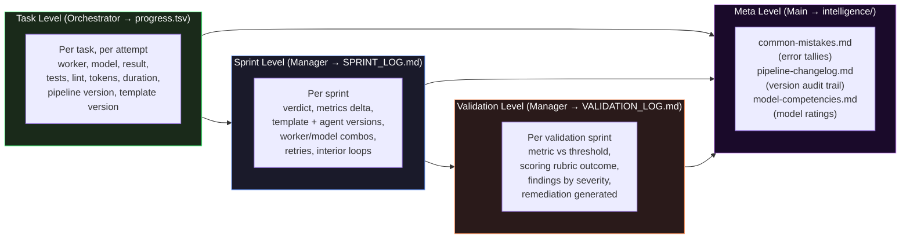

# auto-dev

**A self-improving software development pipeline, run by AI agents.**

Inspired by [karpathy/autoresearch](https://github.com/karpathy/autoresearch) — where an AI agent autonomously improves a training script overnight — **auto-dev** applies the same principle to software engineering. But instead of one agent modifying one file, it's a four-tier hierarchy of specialized agents running structured sprints, with a meta-agent that improves the pipeline itself over time.

Auto-dev is a **skill**, not a framework. It's a set of markdown files you drop into any agentic coding harness. No runtime, no server, no database — just markdown, bash, and git.

---

## Why auto-dev?

A single large model in an agentic loop is the default approach to AI-assisted development. It works — until it doesn't. Context windows fill up, the model drifts off task, costs balloon, and you have no visibility into what went wrong. Auto-dev takes a different approach.

### The pipeline improves itself

This is the core idea. The Main agent watches every sprint's metrics — success rates, retry counts, token usage, blocker patterns — and makes targeted changes to agent profiles, sprint templates, and model assignments based on evidence. Bad changes are reverted. Good changes compound. The factory gets better every time it runs, without human intervention.

### Smaller models, used where they're strongest

You don't need a frontier model for every task. A researcher needs broad knowledge. A coder needs precise syntax. A reviewer needs critical reasoning. Auto-dev assigns each worker the model best suited to its role, exploiting the specialized strengths of smaller, cheaper models rather than paying for one large model to do everything adequately.

### Agents only see what they need

Each worker receives only the context relevant to its task — not the full codebase, not the conversation history, not every prior decision. This keeps agents focused and accurate, avoids context window pollution, and means the framework works regardless of model context window size.

### Agents stay on track

Structured sprints with defined inputs, outputs, and verification steps prevent the drift that plagues long-running single-agent sessions. Each task has a clear scope, a specific worker, and an evidence-based acceptance check. Three strikes and a task escalates — no infinite loops.

### Projects break into manageable chunks

Instead of asking one model to hold an entire project in its head, auto-dev decomposes work into sprints and tasks that each fit comfortably within a single agent's capabilities. The Orchestrator chains outputs between tasks, so context flows through the pipeline without any one agent needing to hold it all.

### Cost scales with complexity, not with context

Smaller models cost less per token. Short, focused contexts mean fewer tokens per call. Parallel workers don't duplicate each other's context. The result: total cost can be a fraction of running a frontier model in a long-running agentic loop, especially for larger projects.

### Every decision is auditable

Progress metrics, sprint logs, blocker reports, validation scores — everything is written to files you can read. When something goes wrong, you can trace exactly which agent, model, sprint, and task was responsible. Single-agent loops give you a chat transcript; auto-dev gives you an audit trail.

### Mix and match models and providers

Agent profiles define roles, not models. Swap in a new model for a specific worker and measure whether it improves results. Run your researcher on one provider and your coder on another. The pipeline's versioned metrics make model comparisons empirical, not anecdotal.

---

## Architecture

### Agent Hierarchy

Four layers. Each layer has a single, clear responsibility. Information flows down as instructions and up as results.



### What Each Agent Owns

| Agent | Reads | Writes | Decides |
|-------|-------|--------|---------|
| **Main** | Everything | `agents/`, `sprints/`, `validation/`, `intelligence/`, `validate.sh`, `program.md` | Sprint templates, agent profiles, model assignments, validation strategies |
| **Manager** | `project/`, `state/`, sprint library | `state/SPRINT_QUEUE.md`, `state/PROJECT_STATE.md`, `state/BLOCKER_REPORT.md`, `state/progress.tsv` | Which sprint to run next, accept/reject output, when to escalate |
| **Orchestrator** | Assigned sprint, relevant `state/PROJECT_STATE.md` sections | Task-level logs | Task dispatch order, retry decisions, context passed to workers |
| **Workers** | Task input + their `agent.md` profile | Task output artifacts (code, docs, tests, reports) | Implementation details within their task scope |

---

## System Flow

### Initialization → Delivery → Improvement

The full lifecycle from a new project to continuous improvement:



### Inside a Sprint

Every sprint — development or validation — follows the same execution pattern. The Orchestrator chains task outputs so each task builds on the last:



### Escalation & Interior Validation

When things go wrong, the system has two mechanisms: the Manager's interior validation loop for tricky code sections, and escalation to Main for structural problems.



---

## The Self-Improvement Loop

This is what separates auto-dev from a static pipeline. The Main agent watches everything and makes the factory better over time.



**Main's improvement toolkit:**

| File | Purpose | Main Uses It To... |
|------|---------|--------------------|
| `intelligence/model-competencies.md` | Which models excel at what | Reassign workers to better models |
| `intelligence/common-mistakes.md` | Recurring error tally | Detect patterns before acting |
| `intelligence/pipeline-changelog.md` | Audit trail of all changes | Track what worked and what didn't |

---

## Repository Structure

```
auto-dev/
│
├── program.md                          ← Main agent instructions (the "brain")
│
├── agents/                             ← Agent profiles with roles + model assignments
│   ├── manager.md                         Project driver
│   ├── orchestrator.md                    Sequence executor
│   └── workers/
│       ├── researcher.md                  Research & analysis
│       ├── architect.md                   System design & planning
│       ├── coder.md                       Implementation
│       ├── writer.md                      Documentation & content
│       ├── ui-designer.md                 Interface design & visual
│       ├── reviewer.md                    Code review & quality gate
│       └── qa-engineer.md                 Testing & verification
│
├── sprints/                            ← Dev sprint library (project-agnostic)
│   ├── planning.md                        Bootstrap: research → arch → scaffold → queue
│   ├── feature-dev.md                     New feature implementation
│   ├── bug-fix.md                         Bug diagnosis and repair
│   ├── refactor.md                        Code improvement without behavior change
│   ├── design-audition.md                 UI/UX design exploration
│   ├── api-integration.md                 External service integration
│   ├── testing-harness.md                 Test infrastructure setup
│   ├── documentation.md                   Docs creation and update
│   ├── performance-optimization.md        Measured performance improvement
│   ├── security-audit.md                  Vulnerability assessment & remediation
│   ├── dependency-update.md               Safe dependency management
│   ├── ci-cd-setup.md                     CI/CD pipeline setup
│   ├── accessibility.md                   WCAG compliance audit & fix
│   └── database-migration.md              Schema change management
│
├── validation/                         ← Validation sprint library (project-agnostic)
│   ├── bug-check.md                       Edge-case & adversarial input testing
│   ├── ui-review.md                       Visual & interaction verification
│   ├── content-analysis.md                Copy & documentation quality
│   ├── competitor-analysis.md             Feature parity & differentiation
│   ├── mission-alignment.md               Goal fidelity check
│   └── board-of-examiners.md              Final multi-perspective panel review
│
├── intelligence/                       ← Main agent's self-improvement toolkit
│   ├── model-competencies.md              Model strengths/weaknesses matrix
│   ├── common-mistakes.md                 Recurring error ledger (tally-based)
│   └── pipeline-changelog.md              Audit trail of every pipeline change
│
├── project/                            ← Project-specific (human fills in)
│   ├── MISSION.md                         Goals, success metrics, constraints
│   └── validation-criteria.md             Pass/fail thresholds per validation type
│
├── state/                              ← Live runtime state (agents manage)
│   ├── SPRINT_QUEUE.md                    Active queue (Manager-populated)
│   ├── PROJECT_STATE.md                   Cumulative codebase knowledge
│   ├── BLOCKER_REPORT.md                  Stuck tasks awaiting escalation
│   ├── SPRINT_LOG.md                      Per-sprint outcomes (Manager writes)
│   ├── VALIDATION_LOG.md                  Detailed validation results + scores
│   └── progress.tsv                       Per-task metrics with versions (Orchestrator writes)
│
├── validate.sh                         ← Automated check runner (lint, test, build)
└── README.md
```

### What's Project-Agnostic vs Project-Specific



The sprint templates and agent profiles are universal — they work for a React app, a CLI tool, an API server, or anything else. The Manager contextualizes them with project-specific details when deploying. Main can author new templates when gaps appear.

---

## Key Principles

### Short Context Discipline

Workers receive only what they need for their specific task. No full-codebase reads. The Orchestrator manages the context chain, passing relevant outputs between tasks. This keeps each agent fast and accurate regardless of model context window size.

### Evidence Over Prose

Every verification task requires concrete artifacts:

| Claim | Not Evidence | Evidence |
|-------|-------------|----------|
| "Bug is fixed" | Prose description | Failing test → now passes + diff |
| "UI looks correct" | "I checked it" | Screenshots at 375px + 1280px |
| "API integration works" | "Tested successfully" | Request/response logs + error handling proof |
| "Code is clean" | "Reviewed and approved" | Specific findings with line references |

### Anti-Hallucination Safeguards

Verification tasks guard against agents fabricating results:

- **Diff check** — does a file diff exist that matches the claimed change?
- **Test check** — does a test pass that didn't pass before?
- **Output check** — does the actual output match the claimed output?
- **Cross-agent verification** — a different agent independently confirms the claim
- **Board of Examiners rule** — every examiner must cite at least 2 weaknesses. Zero-weakness reviews are rejected as insufficiently rigorous.

### Escalation Protocol

Three strikes and move on. No infinite loops.

```
Attempt 1: Standard approach + default model
Attempt 2: Detailed failure context + alternate approach
Attempt 3: Simplified scope — can a smaller version work?
Blocked:   Log to BLOCKER_REPORT.md → escalate to Main → move on
```

### Metrics & Observability

Every action is tracked at two levels:



Main computes derived metrics (revert rate, retry rate, worker/model/sprint fail rates, tokens per success) and uses them to detect patterns before making pipeline changes.

### Versioning

Every mutable file has a `> **Version:** X.Y.Z` header. The Orchestrator logs both the pipeline version and the sprint template version with every task row in progress.tsv. This lets Main do version-correlated analysis:

```
# Did feature-dev v1.1.0 perform better than v1.0.0?
Filter progress.tsv by template_version, compare success rates

# Did the pipeline change from v1.2.0 → v1.3.0 improve things overall?
Filter progress.tsv by pipeline_version, compare all metrics

# Is bug-check validation getting stricter over versions?
Filter SPRINT_LOG.md by template version, compare score trajectories
```

Changes that worsen performance are reverted. The revert is versioned too (patch bump), so Main never tries the same failed change twice.

---

## Quick Start

```bash
# 1. Clone into your project
git clone https://github.com/yourname/auto-dev.git .auto-dev

# 2. Fill in project-specific files
#    project/MISSION.md — what you're building
#    project/validation-criteria.md — your quality thresholds
#    intelligence/model-competencies.md — your available models

# 3. (Optional) Create .auto-dev.env to override validation commands
#    See validate.sh for auto-detection or set LINT_CMD, UNIT_TEST_CMD, etc.

# 4. Point your Main agent at program.md and let it run
```

Works with any agentic harness: Claude Code, Cursor, Cline, OpenClaw, Aider, or custom setups. The agents are defined by their markdown profiles, not by any specific runtime.

---

## Sprint Library Reference

### Development Sprints

| Sprint | First Task | Key Workers | Use When |
|--------|-----------|-------------|----------|
| `planning` | Competitive research | researcher → architect → coder → reviewer | Starting a new project |
| `feature-dev` | Scope & acceptance | architect → qa-engineer → coder → reviewer | Adding new functionality |
| `bug-fix` | Reproduction | qa-engineer → reviewer → coder | Fixing a reported bug |
| `refactor` | Scope definition | architect → qa-engineer → coder | Improving code without behavior change |
| `design-audition` | Requirements | architect → ui-designer → reviewer → writer | Exploring UI directions |
| `api-integration` | API research | researcher → architect → coder → qa-engineer | Connecting to external services |
| `testing-harness` | Assessment | researcher → coder → qa-engineer | Setting up test infrastructure |
| `documentation` | Audit | researcher → writer → reviewer | Creating/updating docs |
| `performance-optimization` | Profiling | qa-engineer → architect → coder | Measured perf improvement |
| `security-audit` | Dependency scan | qa-engineer → reviewer → coder | Vulnerability assessment |
| `dependency-update` | Assessment | researcher → coder → qa-engineer | Safe dependency updates |
| `ci-cd-setup` | Pipeline design | architect → coder → qa-engineer | Build/deploy automation |
| `accessibility` | Audit | qa-engineer → coder | WCAG compliance |
| `database-migration` | Migration design | architect → coder → qa-engineer | Schema changes |

### Validation Sprints

| Sprint | What It Checks | Triggered By | Generates |
|--------|---------------|-------------|-----------|
| `bug-check` | Edge-case inputs, fringe data, adversarial patterns | After dev sprints complete | Remediation sprint items |
| `ui-review` | Visual fidelity, responsiveness, interaction quality | UI changes | Remediation sprint items |
| `content-analysis` | Spelling, consistency, tone, accuracy of all copy | Content changes | Remediation sprint items |
| `competitor-analysis` | Feature parity, differentiation, market readiness | Pre-release | Gap sprint items |
| `mission-alignment` | Does the product serve the stated mission? | Pre-release | Alignment gap items |
| `board-of-examiners` | Final multi-perspective panel review | Final gate | Blocking issues |

Main can create additional validation types per project (e.g., regulatory compliance, localization review, data integrity audit).

---

## Design Philosophy

The human defines the destination (`MISSION.md`) and the quality bar (`validation-criteria.md`). Everything else is the pipeline's job.

```
Human:        "Build X that meets these standards"
Main agent:   assembles the factory
Manager:      runs the factory
Orchestrator: manages the assembly line
Workers:      build the product
Main agent:   makes the factory better for next time
```

The system is **provider-agnostic** (agent profiles define roles, not models), **framework-free** (just markdown + bash + git), **self-contained** (no external services), **observable** (every action logged), and **self-improving** (Main evolves the pipeline based on measured evidence).

---

## License

MIT
